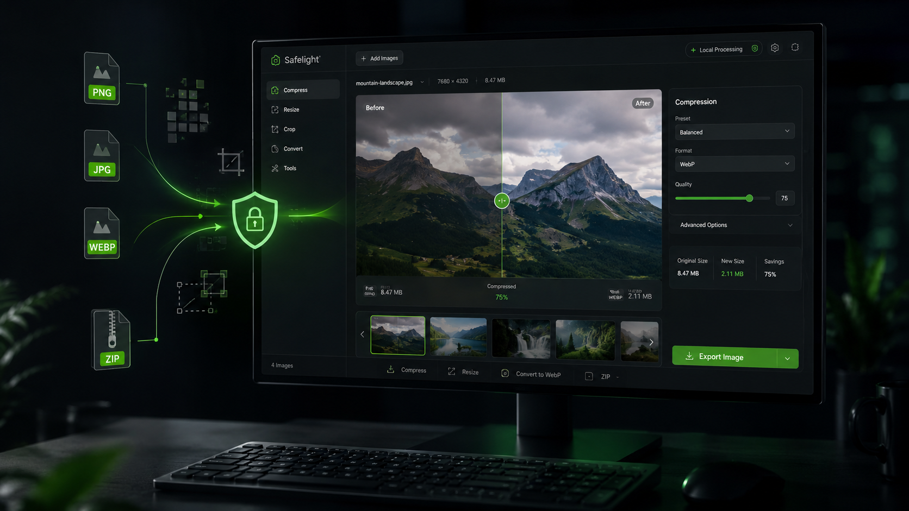

# Safelight

> Локальный image toolkit для браузера. Быстрая обработка изображений без отправки пользовательских файлов на сервер.



**Safelight** — image processing without sending your images away.

[](LICENSE)
[](https://deenfoool.github.io/safelight/)

**Демо:** [deenfoool.github.io/safelight](https://deenfoool.github.io/safelight/)

---

## О проекте

**Safelight** превращает браузер в небольшой графический инструмент: сжатие, конвертация, изменение размера, нарезка, коррекция и другие операции выполняются прямо на устройстве пользователя.

- Никаких аккаунтов
- Изображения не загружаются на сервер Safelight
- Изменения применяются к рабочему изображению в реальном времени
- Экспорт выполняется одной общей кнопкой
- Каждый инструмент работает от исходного изображения, а не от результата предыдущего
- Можно установить как PWA-приложение

## Возможности

- PNG / JPEG / WebP
- PDF → PNG / JPEG / WebP (первая страница)
- PNG / JPEG / WebP → PDF
- Сжатие и контроль качества
- Нарезка изображений с перетаскиваемыми линиями и ZIP
- Изменение размера и обрезка
- Базовая цветокоррекция в реальном времени
- Поворот и отражение
- Перетаскиваемые водяные знаки и режим заполнения изображения
- Размытие и пикселизация выбранных областей с ручным перемещением и изменением размера
- Пакетная обработка
- Просмотр EXIF/XMP-метаданных: камера, объектив, дата, параметры съёмки, автор и GPS
- Предупреждение о сохранённой геолокации и оценка объёма метаданных
- Очистка метаданных при экспорте с выбором категорий для JPEG; PNG/WebP создаются без исходных метаданных
- Генерация favicon-пакета
- PWA: manifest, service worker, install prompt и кэширование интерфейса
- Адаптивный интерфейс

## Приватность

Само изображение обрабатывается локально через Browser APIs / Canvas. Safelight не отправляет загруженный файл на свой backend.

Инструмент «Метаданные» анализирует EXIF/XMP/текстовые блоки прямо в браузере. При экспорте Safelight может создать очищенную копию изображения; оригинальный файл при этом не изменяется.

Инструмент размытия/пикселизации также работает локально: области хранятся только в состоянии страницы и применяются к экспортируемой копии.

PWA кэширует собственные файлы интерфейса Safelight. Внешние зависимости и шрифты всё ещё могут потребовать интернет при первом использовании соответствующей функции; пользовательские изображения им не отправляются.

## Системные требования

| Требование | Значение |
|---|---|
| ОС | Любая современная ОС |
| Браузер | Chrome / Chromium / Firefox / Edge / Safari |
| Backend | Не требуется |
| Интернет | Для первого открытия внешних библиотек; основной PWA-интерфейс кэшируется |

## Установка / запуск

Safelight не требует сборщика или backend.

```bash
git clone https://github.com/Deenfoool/safelight.git
cd safelight
```

Для локальной разработки удобнее запустить простой HTTP-сервер:

```bash
python -m http.server 8080
```

или

```bash
npx serve .
```

После этого открой локальный адрес в браузере.

## Технологии

- HTML5
- CSS3
- Vanilla JavaScript
- Canvas API
- Service Worker / Web App Manifest
- JSZip
- PDF.js
- jsPDF

## Почему Safelight?

Для большинства простых операций с изображениями не нужен удалённый сервер. Safelight использует возможности браузера, поэтому исходный файл остаётся на устройстве пользователя, а обработка происходит локально.

## Roadmap

- [x] Сжатие
- [x] Нарезка
- [x] Конвертация
- [x] PDF-конвертация
- [x] Изменение размера
- [x] Обрезка
- [x] Коррекция
- [x] Трансформация
- [x] Водяной знак
- [x] Пакетная обработка
- [x] EXIF/XMP inspector и очистка метаданных
- [x] Favicon
- [x] Редактирование в реальном времени
- [x] Изоляция результатов между инструментами
- [x] Интерактивные линии нарезки
- [x] Перетаскиваемый watermark
- [x] Размытие и пикселизация областей
- [x] PWA / установка как приложение
- [ ] Палитра изображения
- [ ] Полностью автономный vendor-пакет без CDN
- [ ] Локальные шрифты без Google Fonts

## Лицензия

[MIT](LICENSE)

---

**Safelight** — image processing without sending your images away.
